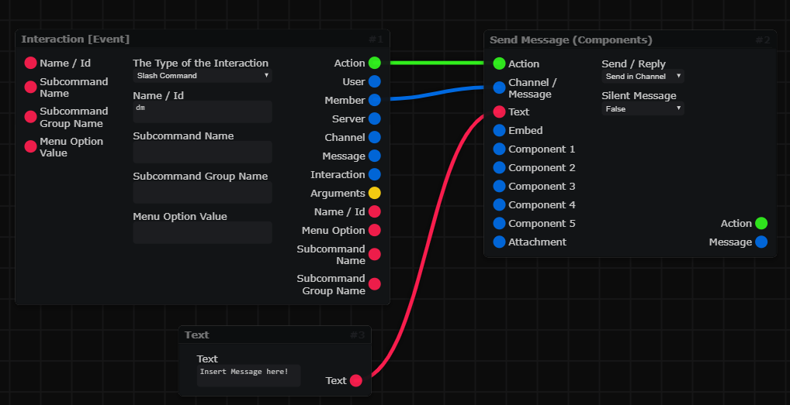
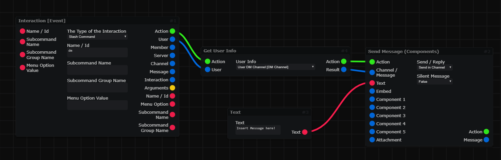

icon: material/gesture-tap

# :material-gesture-tap: Basic Actions

This Page includes some Basic Actions that can be Done within DBB.

=== "DM a User"
    <h2> DM a User </h2>

    :   !!! warning "Important Note:"
            If a User has DMs Blocked then an Error might occur... A Fix that for will come soon™ hopefully.

    :   There are two ways to DM a user:
    :   * Connect the Member Object
        :   

        :   ***OR*** 
    
    :   * Use a `Get Member/User Info` Block to get the DM Channel and then use that...
        :   

=== "Build a Prefix Command"
    <h2> Build a Prefix Command </h2>

    :   You probably know that mostly all bots used things called `Prefix Commands` before there were `Slash Commands`, but now there will be a tutorial how to setup a Prefix Command since many people still don't know how to do it.

        :   

    :   Now to build for example that the user needs to add a Argument you can use the `Get Message Argument(s)` Block. A Check if that Argument exists would also be needed...  
    If the Block will only have one Argument which contains spaces then you should use the `Multiple Arguments` Option...  

        :   