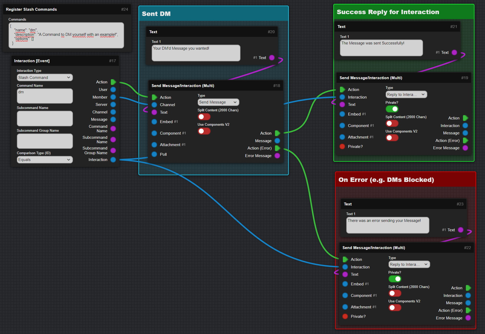
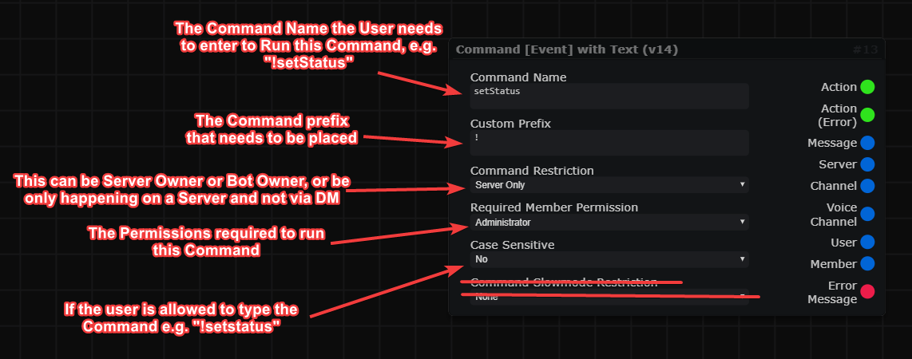
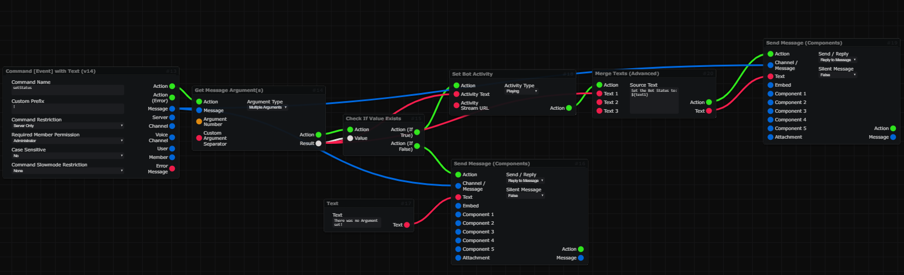

icon: material/gesture-tap

# :material-gesture-tap: Basic Actions

This Page includes some Basic Actions that can be Done within DBB.

=== "DM a User"
    <h2> DM a Member/User </h2>

    :   Directly Connect the Member/User Object to a Channel Input of a Send Message Block!

    

=== "Build a Prefix Command"
    <h2> Build a Prefix Command </h2>

    :   !!! danger "Prefix Commands Support Deprecated"
            The Support for Prefix Commands was ended, you can still use the Command Event Block, but things like the Owner Filter and Custom Prefix wont work anymore!

            Please use Slash Commands for better Support and easier handling!

    :   You probably know that mostly all bots used things called `Prefix Commands` before there were `Slash Commands`, but now there will be a tutorial how to setup a Prefix Command since many people still don't know how to do it.

        :   

    :   Now to build for example that the user needs to add a Argument you can use the `Get Message Argument(s)` Block. A Check if that Argument exists would also be needed...  
    If the Block will only have one Argument which contains spaces then you should use the `Multiple Arguments` Option...  

        :   