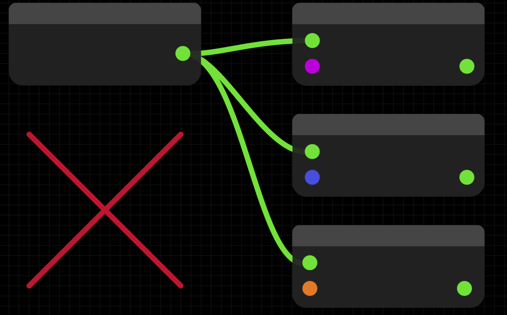
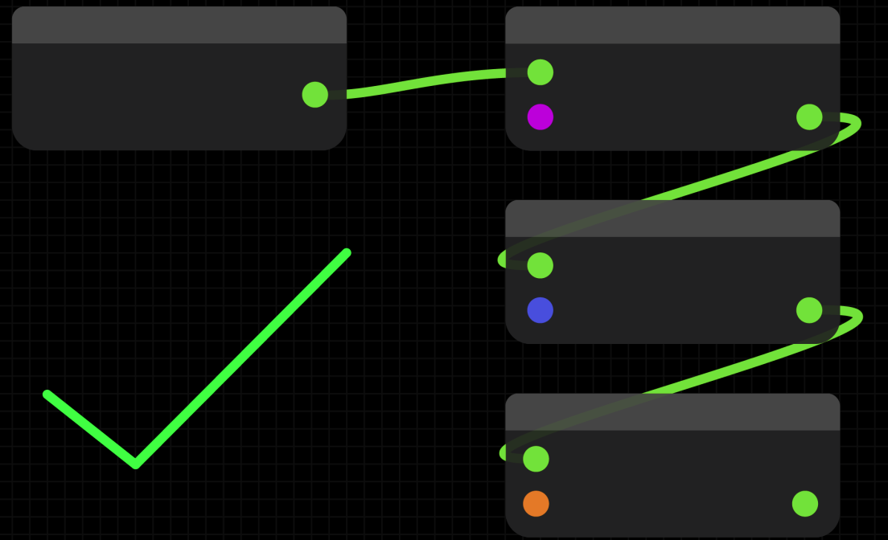
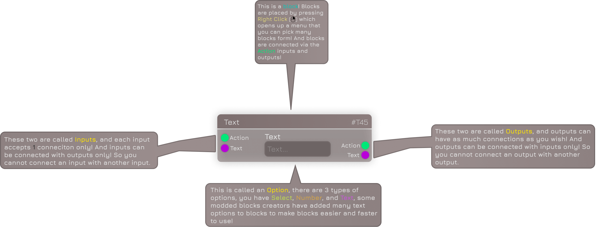

icon: material/alert-octagon-outline

# :material-alert-octagon-outline: Basic Rules

Discord Bot Builder seems pretty easy at first, but some beginners may find some errors and don't know how to fix them.
So here are some Rules that you need to remember when you want to use DBB.

---

## Never Split Actions

:   | Wrong Way                             | Correct Way                               |
| :---------------------------------------: | :---------------------------------------: |
|  |  |

## Block Explaination

:   Blocks have special properties which we visualized in this Picture:
