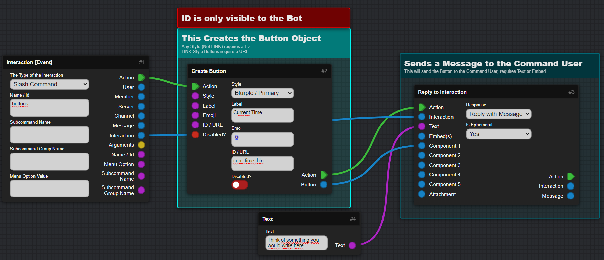
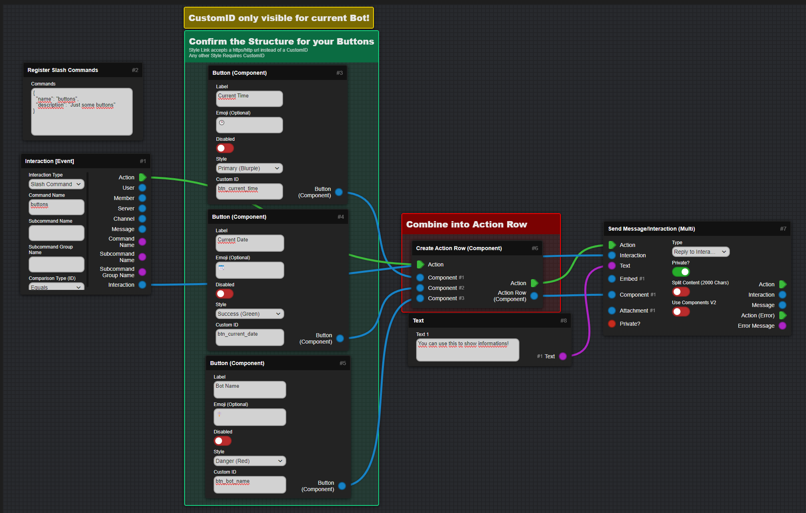
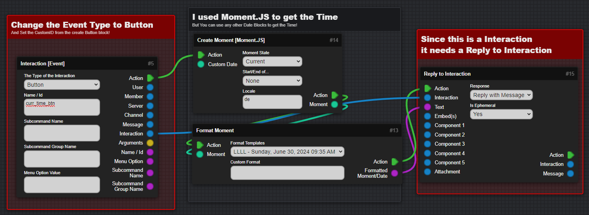
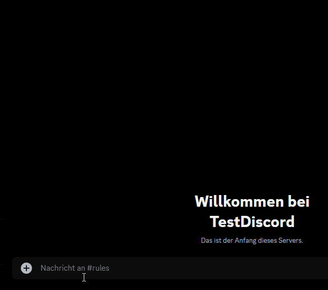
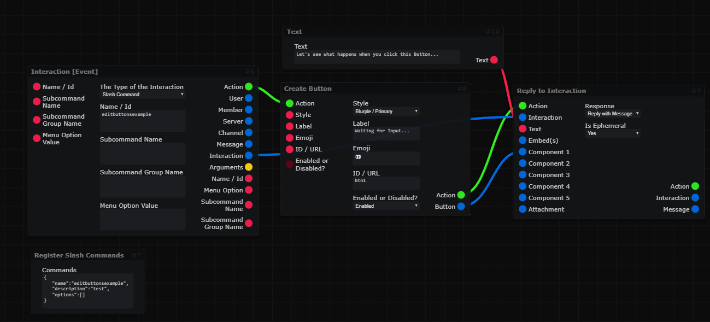
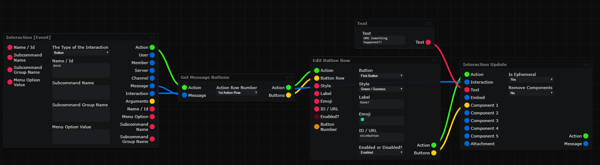
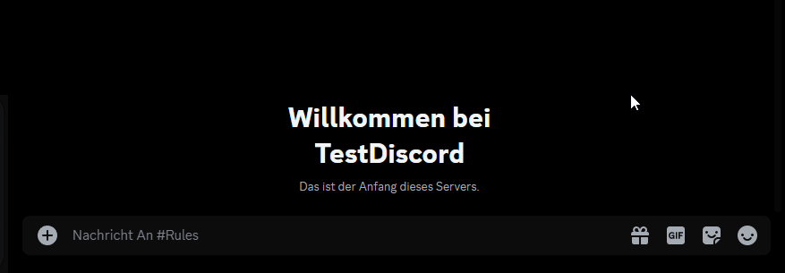

icon: material/gesture-tap-button

# :material-gesture-tap-button: Buttons
This Section will cover how to create a button, multiple buttons and also detect and handle button inputs.

???+ danger "This Page explains using Mods!"
    :   This Page includes Content using Community Created Mods and may vary from your experience!

    :   [Go to Documentation page for Mods :fontawesome-solid-arrow-right:](mods.md){ .md-button .md-button--primary }

!!! warning "Important"
    - Each Button needs a Custom ID to detect when it was Pressed
    - You can get a Emoji on Windows using ++windows+period++

---

=== "1. Creation"

    ??? info "Slash Command Structure"
        ```json
        {
            "name": "buttons", 
            "description": "Just some buttons"
        },
        {
            "name": "button", 
            "description": "Just a button"
        }
        ```

    ## Create One Button
    : This Alignment will Trigger on the Slash Command /buttons and, which will create and send the button with the `Send Message/Interaction (Multi)` Block.  
    : 

    ### Create Multiple Buttons
    : We are going to use the same command like the first one and just add more `Button (Component)` Blocks. In Combination with `Create Action Row`
    : 

=== "2. Event Handling"
    ### Detect and handle a Button Press

    :   You can use the `Interaction [Event]` to detect a Button Press using the Custom ID. Also to get the Current Time and Date you use the `Create Date` Block and using the `Format Date` Block you can get the Date in a Text Type.
    
    :   To now send a message back to the User that used the Button, you can use the `Send Message/Interaction (Multi)` Block.  

        :   (Ephemeral means only visible to the user)

    :     

=== "3. Testing"
    ### Testing Everything
    :   When you launch the bot you can now use the example command that was created, and with that the 3 Buttons should be sent. When you now click on a Button the message you reply!
    :   


=== "Editing a Button"
    ## Edit a Button
    :   You can also edit a Button, for example when you want to change the Label or the Style.

    ### Example Button to edit
    :   To edit a Button you need a button that you want to edit, for this we are going to use a slash command which is going to create the button and then reply it to the interaction.
    :   

    ### Getting to the Edit Button
    :   Now you have multiple ways how and when to edit the button, the simplest is to take the [Interaction Event](https://blocks.dbb.software/Blocks/interaction_event.js "Download the Block!"){:target="_blank"} Block and then use [Get Message Buttons](https://blocks.dbb.software/Blocks/get_interaction_message_buttons.js "Download the Block!"){:target="_blank"} Block to get the Buttons from the Message and then use the [Edit Button Row](https://blocks.dbb.software/Blocks/edit_button_row.js "Download the Block!"){:target="_blank"} Block to edit the Button of the Message. At the end use the [Interaction Update](https://blocks.dbb.software/Blocks/interaction_update.js "Download the Block!"){:target="_blank"} Block to update the Interaction with the New Button and a New Text/Embed.
    

    ### How it looks in Discord
    :   

---

## Still Issues or Questions?
:   If you have Issues or any questions you can always ask on the [Discord Bot Builder Discord](https://discord.gg/PAzxTDw){:target="_blank"}, or send me a DM: `xcrafttm`!