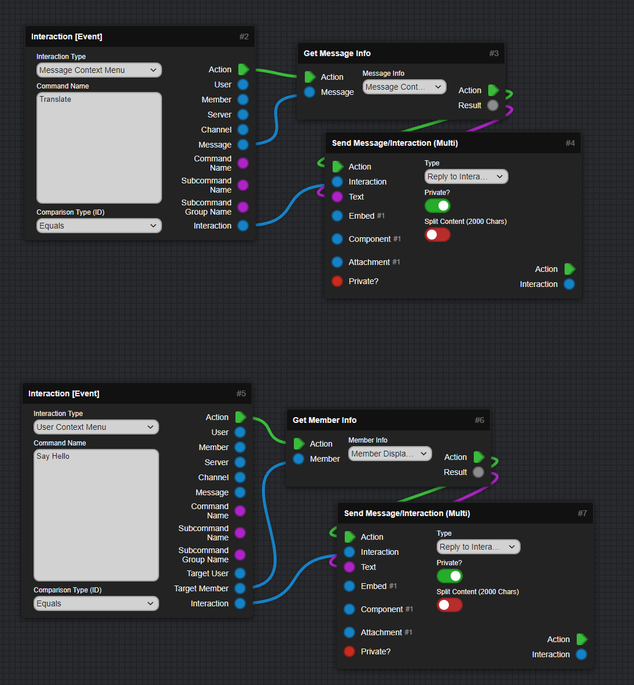

---
hide:
  - toc
icon: material/form-select
---

# :material-form-select: Context Menu
This Section will explain how to create and use Context Menus!

???+ danger "This Page explains using Mods!"
    :   This Page includes Content using Community Created Mods and may vary from your experience!

    :   [Go to Documentation page for Mods :fontawesome-solid-arrow-right:](mods.md){ .md-button .md-button--primary }

The Idea is pretty straight-forward. Just register them like normal slash commands, then catch them when used, using `Interaction Event` Blocks and then you can continue like you want:  

:   

Here is the Copyable version of the JSON Text:
:   
``` json
{
    "name": "Translate",
    "type": 3
},
{
    "name": "Say Hello",
    "type": 2
}
```