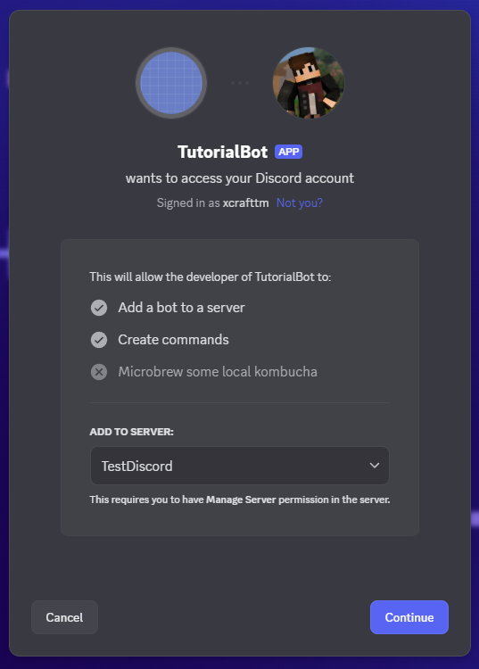
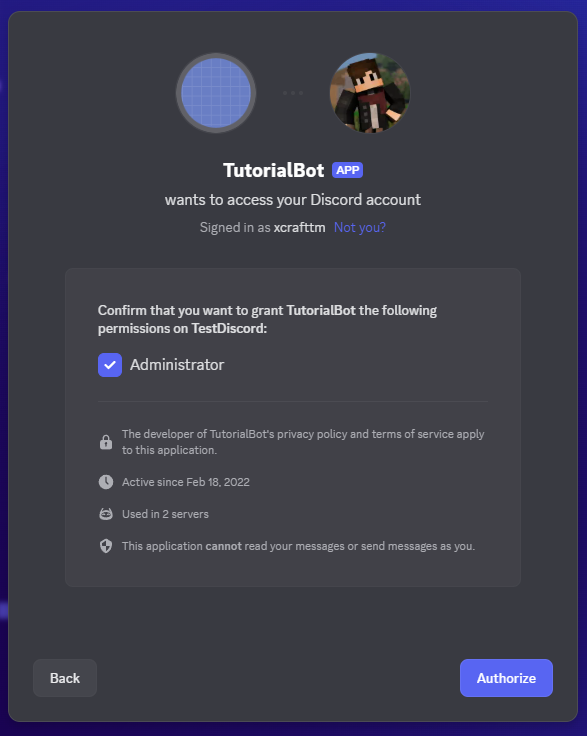
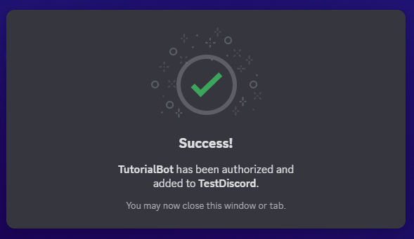
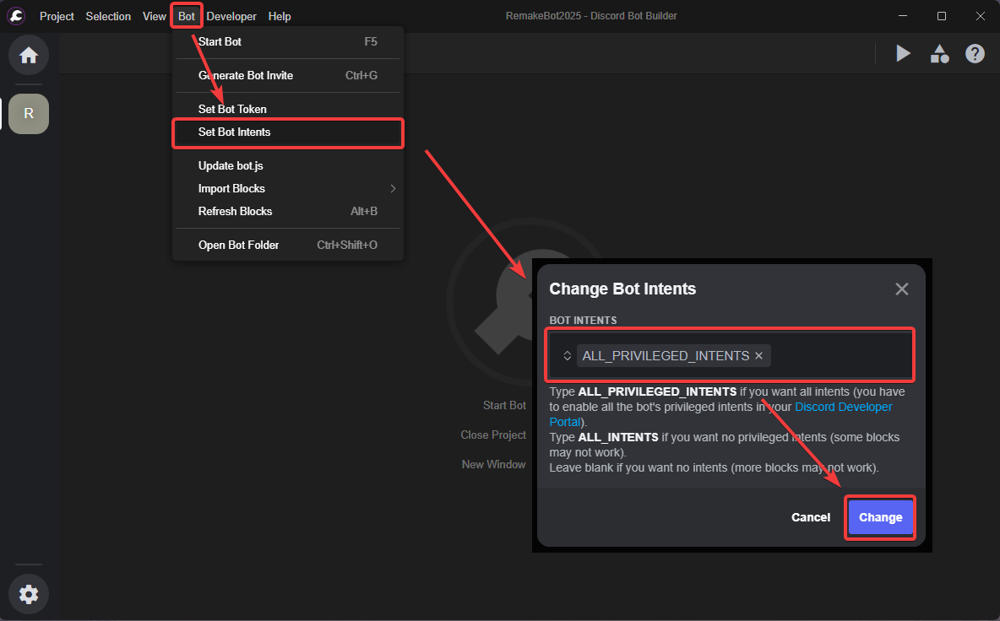
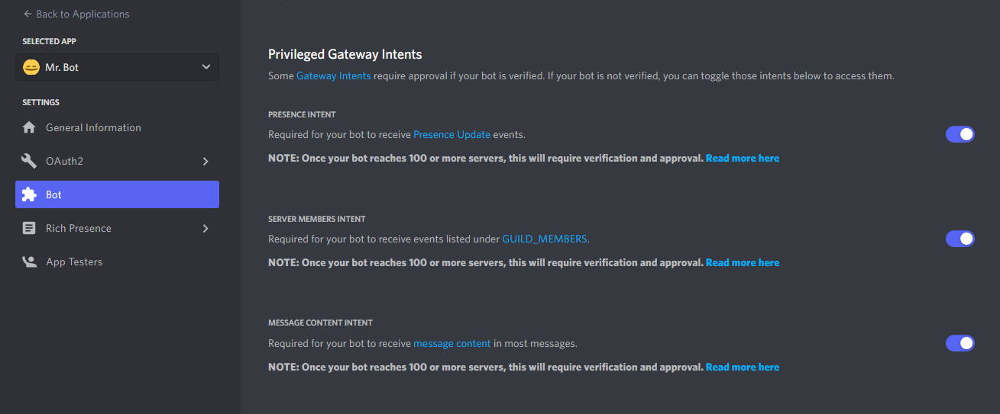

---
hide:
  - toc
icon: material/information-variant-box
---

# :material-information-variant-box: Getting Started
This section will explain how to install NodeJS, setup a Bot Project within DBB as well as create and invite your Discord Bot!  
***

=== "1. Preparation"
    <h3>Installing Node.js</h3>

    :   In order to allow your bot to run, you will need to install Node.js:

    :   ???+ info "Installing on Windows"
            - Click [here](https://nodejs.org/dist/v22.12.0/node-v22.12.0-x64.msi){:target="_blank"} to download the installer for the LTS version of Node.js.
            - Follow the installer's instructions

    :   ???+ info "Installing on Ubuntu via CLI"
            - Copy these commands using the copy button in the top right hand corner of the box and paste them into your command line.
            ```
            curl https://raw.githubusercontent.com/creationix/nvm/master/install.sh | bash
            source ~/.bashrc
            nvm install v22
            ```

    ***

=== "2. Creating a Project"
    <h3>Create Your First Project</h3>

    :   1. Start DBB. You will be greeted with this screen:

        :   
    <br>

    :   2, Click on Create New Project. You should now have this screen:

        :   
    
        :   After these Steps, you now have a Temporary Project opened in which you can start creating your Bot.

        :   To Make sure that you progress is not lost after a restart, you can save your Project by clicking on the `Save` Button in the Top Left Corner in the `Project` Menu.

        :   <br>

        :   Then, a Window Pops up in which you can go into the Folder you want to the Save the Project in and then also set a Project Folder name. After that you can click on `Save`.

        :   <br>

    ***

=== "3. Creating a Discord Bot"
    <h3>Create a New Bot Account and Set it Up in DBB</h3>

    :   Go to the [Discord Developer Portal](https://discord.com/developers/applications){:target="_blank"} and do the following things:

        :   1. Create a New Application with the name of your Choice <br>
            2. Go to "Bot", and click "Add Bot" <br>
            3. After that you go down and enable the 3 "Privileged Gateway Intents" <br>
            4. Disable Public bot, to make the bot only inviteable via the URL <br>
            5. Copy the Bot Token and save it for later... <br>
            (**Note: MAKE SURE TO KEEP THE TOKEN SECRET AT ALL TIMES! IF SOMEBODY GETS THE BOT TOKEN, THEY CAN ACCESS AND ABUSE YOUR BOT!**) <br>

    :   <br>
    <br>
    Input it into DBB. Do this by selecting the Bot menu in the toolbar at the top of the screen and selecting Set Bot Token. Then paste the token and hit Enter or click OK.

    :   <br>
    <br>

    :   Now you need to invite the bot to your server. You can get a Link by Going into the Discord Developer Portal, selecting your Application, going to OAuth2, and then selecting the `bot` and `application.commands`(Slash Commands) scope. After that you can select the permissions you want to give the bot and then copy the link.

    :   <br>
    <br>

    | Image | Description |
    |-------|-------------|
    |  | Open the invite link and select your server. |
    |  | Adjust the bot's permissions and click Authorize. |
    |  | Complete reCAPTCHA and verify the invitation. |

    :   That means you're all set and the bot's now in your server.

=== "4. Extras (Recommended)"
    <h3>Installing Mods</h3>

    :   Installing Mods is really important for DBB, cause all the Docs Pages rely on the Mods, since they work the best and provide the best features!  

    :   [One Click Install :fontawesome-solid-download:](dbb://download/blocks?url=https://blocks.dbb.software/download/all){ .md-button .md-button--primary }  

    <h3>Set Intents</h3>

    :   DBB comes with a Problem by not setting all Privileged Intents of Discord by Default, to change that you need to do the following:

    :   

    :   <h4>Don't Forget to change your Intents on the [Discord Developer Portal](https://discord.com/developers/applications)</h4>

    :   

=== "Other Important Stuff"
    !!! warning "Important"
        Without an event, your command will never work! Events are the only blocks that have no "Action Connection" input since they get triggered by the bot itself.

    ??? knowledge "Variable Types"
        

    The line types must match to connect two blocks.

    On the Output side of the block, there can be as many connections to one point as you like (except on the action type).

    On the Input side of the block, there can always only be one connection per point.

    ??? knowledge "Good to know"
        Server = Guild

        User ≠ Member

        A member is a user that is relevant to the guild only. You can execute actions to do with a specific server with a member.
