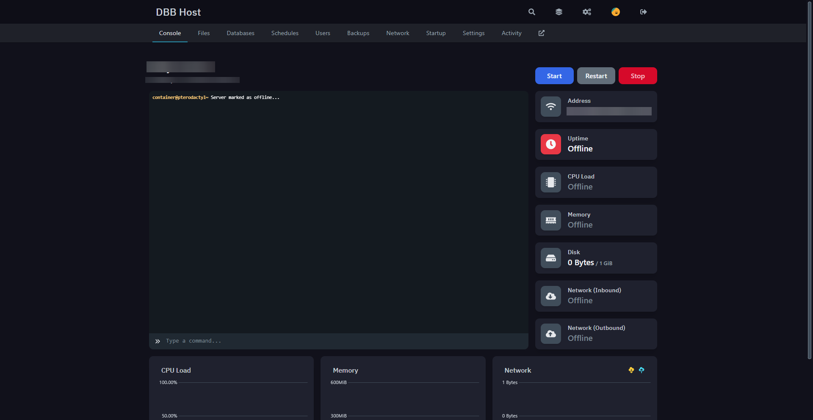

---
hide:
  - toc
icon: material/server-network
---

# :material-server-network: Host Bot 24/7

You have the Option to host your Bot on your own Home Server, on a Monthly Payed Rootserver/VPS or a special Bot Hosting.  
Here, we will go through all these ways!  

=== "Rootserver/VPS (LINUX)"
    <h2> Host on Rootserver/VPS with Root Access (LINUX) </h2> 

    1. Log into your Rootserver/VPS using a Root Account, then start by Installing Node.JS (If not installed already).  
      ```bash
      curl https://raw.githubusercontent.com/creationix/nvm/master/install.sh | bash
      source ~/.bashrc
      nvm install v22
      ```
    
    2. Create a new Folder for your Bot and navigate into it.
    It's recommend that you use a Folder like `/home` for your Bot
    ```bash
    cd /home # To get into the Home Directory
    mkdir MySpecialBot # To create a new Folder
    cd MySpecialBot # To navigate into the Folder
    ```

    3. Upload your Bot Files into the Folder you just created.  
        - Use a (S)FTP Client of your choice to upload the Files, for example WinSCP or FileZilla work great.  
        - Create a New Connection with the IP/Domain of your Server, Username(root) and Password.  
        - Navigate to the Folder you just created and Drag-and-Drop the Files into it.  
      Here is a list of things you need to Upload, leave everything else away. NOTE: Upload the Full Blocks Folder!  
      ```
      ├── blocks/  
      │   ├── block1.js  
      │   ├── block2.js  
      │   └── etc...  
      ├── data/  
      │   ├── data.json  
      │   ├── INTENTS.txt  
      │   ├── token.txt  
      │   └── workspaces.json  
      ├── bot.js  
      └── package.json  
      ```

    4. Run the Bot using the following Command:
      ```bash
      node bot.js
      ```
      This will start the Bot and you should see the Bot Online in your Discord Server.

    5. Optional, to run the Bot 24/7, using Screen
      ```bash
      screen -S BotName node bot.js
      ```
      This will start the Bot in a Screen Session, to detach from the Screen use `CTRL+A` and then `CTRL+D`. To reattach use `screen -x BotName`.

=== "Bot Hosting Service (Pterodactyl)"
    <h2> Host on a Bot Hosting Service (Pterodactyl) </h2>

    You should find your Server on the Dashboard looking like this:  
      

    Now you have two Options on how to Upload your Files:
    :   <h3> __ZIP-File Way__ </h3>
      *Note: Supports `.rar` & `.tar.gz`*  
      - Create a Zip File including the files of your Project.  
      ```
      ├── blocks/  
      │   ├── block1.js  
      │   ├── block2.js  
      │   └── etc...  
      ├── data/  
      │   ├── data.json  
      │   ├── INTENTS.txt  
      │   ├── token.txt  
      │   └── workspaces.json  
      ├── bot.js  
      └── package.json  
      ```  
      - Upload the File to the Server in the "Files" Tab of the Panel Dashboard Website  
      - Next to the ZIP File click the 3 Points, and there press "Unarchive"  
      - Delete the ZIP once finished (OPTIONAL)  

    :   <h3> __SFTP Way__ </h3>
      *Note: Requires WinSCP to be Installed*  
      - On Your Server, go to "Settings"  
      - There click on "Launch SFTP"  
      - Then a Window Pops-Up asking you for a password, enter your Dashboard Account Password and click "OK"  
      - Once connected, Upload your Bot Files to the "/" Directory of the Server.  
