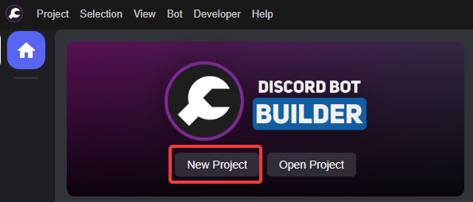
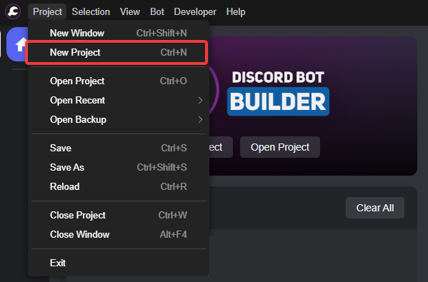
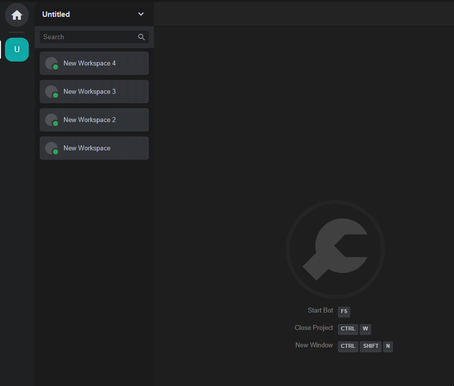
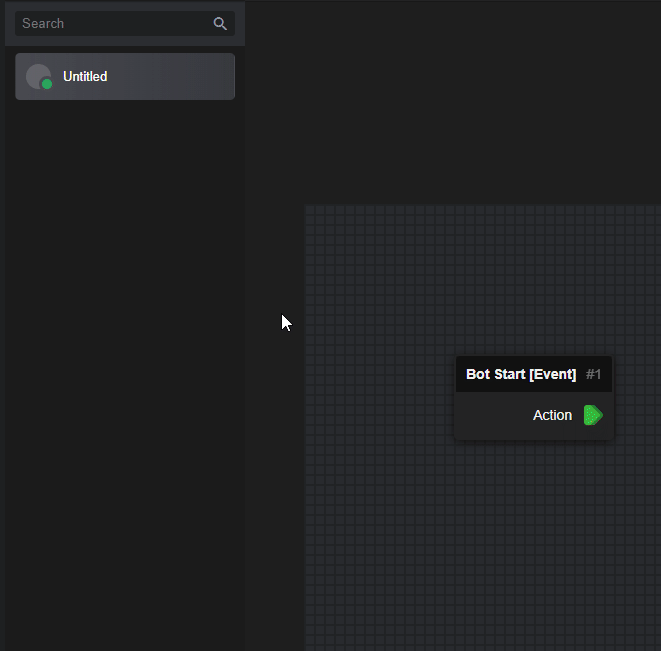
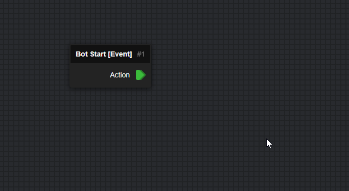
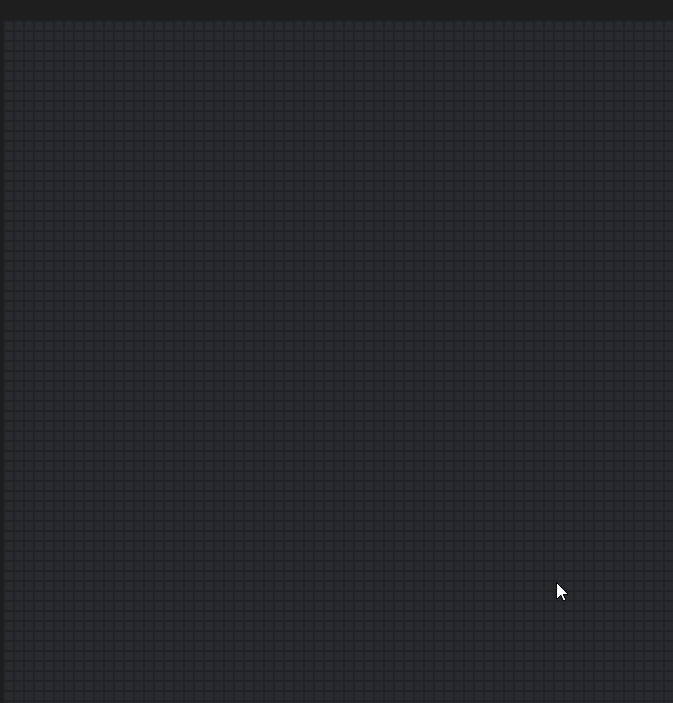
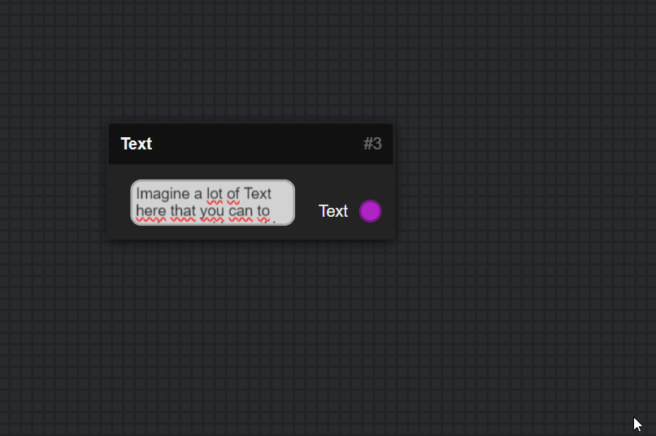
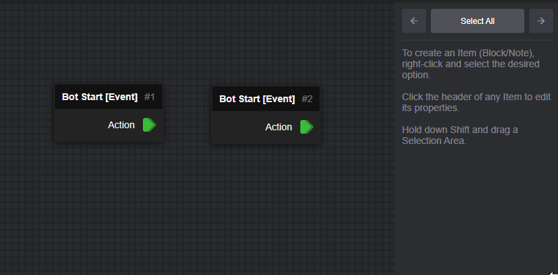
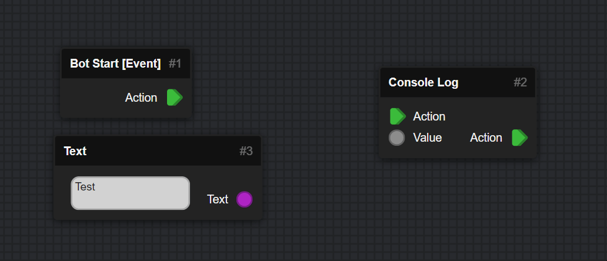
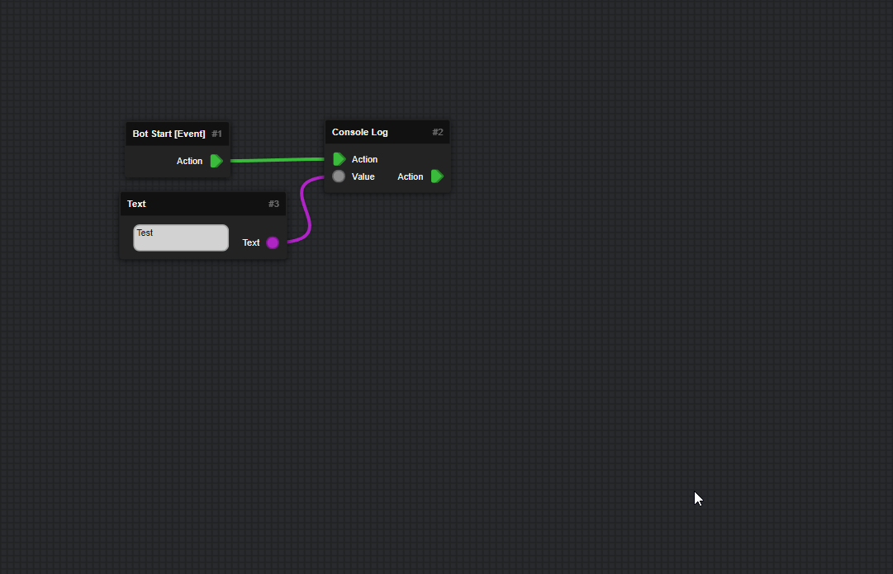

<meta content="How to use DBB - DBB Documentation" property="og:title" />
<meta content="Ever wondered how DBB Works? Learn the Basics about the Usage here!" property="og:description" />
<meta content="https://dbb.software/" property="og:url" />
<meta content="https://raw.githubusercontent.com/XCraftTM/DBBDocs/refs/heads/main/docs/assets/favicon.png" property="og:image" />
<meta content="#292e4a" data-react-helmet="true" name="theme-color" />

# :material-domain: How to use DBB

## Create a Project

| Either on the Start Page                          | Or In the Toolbar
| :------------------------------------------------ | :------------------------------------------------ |
|  | 

---

## Switch Workspaces

Workspaces are important parts of making a Bot, as they allow you
to split parts of the Bot to make it visually more appealing and easier to find things you created.  

{ width="700" }

---

## Manage Workspaces

You can manage any Workspace, by using your Right Mouse Click Button on a Workspace in the left Sidebar.  
That opens a Editor View like a User Profile on Discord.

This allows you to change the Name, Profile Color and Banner Image.  
As well as setting a description/note for the workspace for when you share it.  

{ width="600" }

---

## Handling Blocks

There is quite a few way to handle Blocks in DBB, here are some!

:   ### Move 'em

:   You can grab each Block by its Name-Bar and then drag it to where you want it.

:   { width="600" }

:   ### Place 'em

:   You can place Blocks by right-clicking a space on the Workspace.  
    There you can either search for the Block with the search bar at the Top.  
    Or scroll through the Categories to find the Block you want.  

:   { width="700" }

:   ### Resize 'em

:   You can resize Blocks by pressing and holding the bottom right corner of a Block to change its size.  
    You can also Resize by dragging the Edges of the Block to just change the Horizontal or Vertical Size.  

:   { width="700" }

:   ### Delete 'em

:   You can delete any Block by using the ++del++ Key on your Keyboard, or using the Delete Button on the Right!

:   { width="700" }

:   ### Dis- / Connect 'em

:   You can Connect Blocks with eachother by hold and dragging the Dot on the Left/Right Side of a Block to another Block.
    Disconnect them by pressing ++del++ on your keyboard, or using the Delete Button on the Right.

:   { width="700" }

:   ### Mark - Copy 'n Paste

:   You can "mark" a Collection of Blocks by Holding the ++shift++ Key on your Keyboard and Holding ++lbutton++ on your Mouse while dragging a square to hold a collection of Blocks.  

    You can then Grab one Block by the Name-Bar to move the Blocks as a collection.  
    You can use ++ctrl+c++ and ++ctrl+v++ to Copy and Paste the Marked Blocks.  

:   { width="800" }