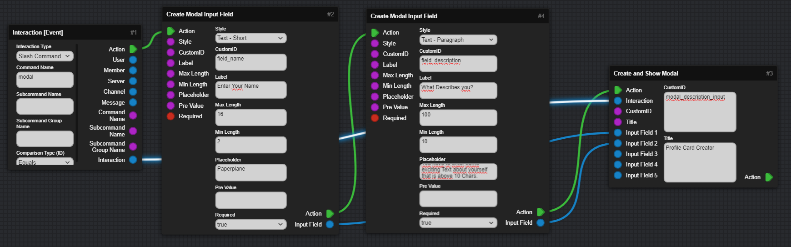
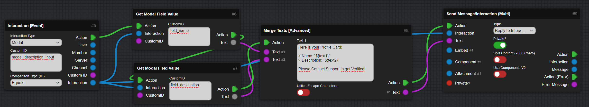

icon: material/form-textbox

<meta content="Modals - DBB Documentation" property="og:title" />
<meta content="A Modal is a box that appears after a Interaction where the user can fill infos." property="og:description" />
<meta content="https://dbb.software/" property="og:url" />
<meta content="https://raw.githubusercontent.com/XCraftTM/DBBDocs/refs/heads/main/docs/assets/favicon.png" property="og:image" />
<meta content="#292e4a" data-react-helmet="true" name="theme-color" />

# :material-form-textbox: Modals
This Section will explain how setup a Modal, and show that to the User and also fetch what the User Inputed into the Modal.

???+ danger "This Page explains using Mods!"
    :   This Page includes Content using Community Created Mods and may vary from your experience!

    :   [Go to Documentation page for Mods :fontawesome-solid-arrow-right:](/mods){ .md-button .md-button--primary }

## Setup Modal
:   !!! warning "Important"
        * To be able to receive a Modal, a normal Prefix Command is not working, you will need some kind of Interaction. 
        
        :   This can be a Slash command, Button or Select Menu.  

    After the `Interaction [Event]` Block we will use the `Create Modal Input Field` Block to create Text Inputs for the Modal, you can customize these to your liking.  

    After that, add each Input Field Object to a List that you create using the `Create List` Block and add them using the `Add Item to List` Block.  

    After all that you use the `Create and Show Modal` Block to finish the Modal and show it to the User.  

    (Defering or Replying to the Interaction is not needed right now, but later...)  

    

## Reacting to the Modal
:   You just use the `Interaction [Event]` again, set it to Modal, and enter CustomID of the Modal.  

    Then use the `Get Modal Argument by Name` to get both Field Inputs, and use them as you like. In this Example we will add them together using `Merge Texts (Advanced)`.  

    After that Reply to the Interaction to tell the User that we received the Input!  

    

## Testing in Discord

:   