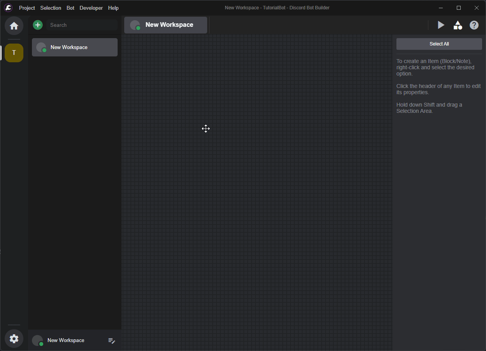

icon: material/download-box

<meta content="Community Modded Blocks - DBB Documentation" property="og:title" />
<meta content="The Community Blocks Include more functions for the usage in DBB which are not included by default and are recommended to be installed if not already done so. You can also follow this guide to update your Blocks." property="og:description" />
<meta content="https://dbb.software/" property="og:url" />
<meta content="https://raw.githubusercontent.com/XCraftTM/DBBDocs/refs/heads/main/docs/assets/favicon.png" property="og:image" />
<meta content="#292e4a" data-react-helmet="true" name="theme-color" />

# :material-download-box: Installing Mods

Installing Mods is pretty Straight forward... Press a Button in DBB, Paste a URL, Wait.. and Done!

=== "Automatic Way"
    ## Installing
    :   As of v1 you can now download and install Modded Blocks in DBB.  

    :   For that you go to the `Bot` Tab and there hover over `Import Blocks` and then click on `Download Blocks`, 

    :   For Modded Blocks you can use the following URL:
    ```
    https://blocks.dbb.software/Blocks/!allBlocks.zip
    ```

    :   there you paste the URL from the Download Button at the Top of this Page and then click `Download`.

    :   

=== "Manual Way"
    ## Downloading
    :   You need to Download the blocks from the `currently` official DBB Block Storage Website.  
        [Download All Blocks :fontawesome-solid-download:](https://blocks.dbb.software/Blocks/!allBlocks.zip){ .md-button .md-button--primary }
        [Storage Server :fontawesome-solid-link:](https://blocks.dbb.software/Blocks/){ .md-button target="_blank"}
    
    ### Dragging into the Blocks Folder
    :   After Downloading the ZIP File of all the Blocks or just one Block file,
        you need to open your Project folder and then Drag the Block file into the Blocks folder.
        The ZIP file has to be extracted into the Blocks Folder.


