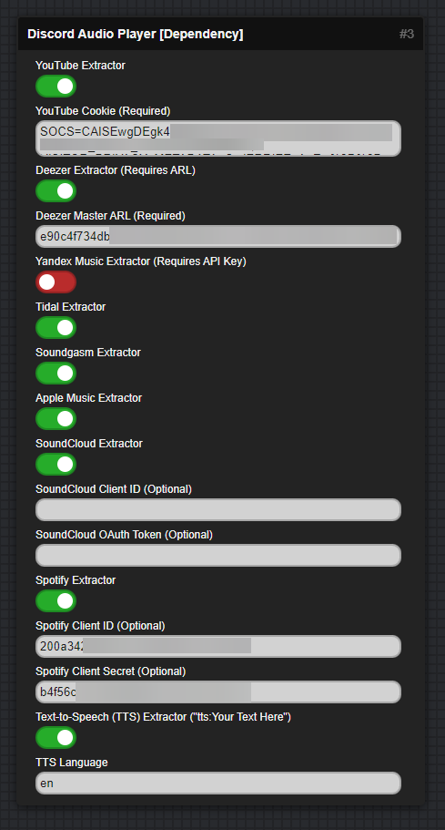
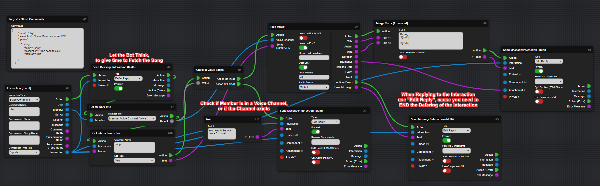
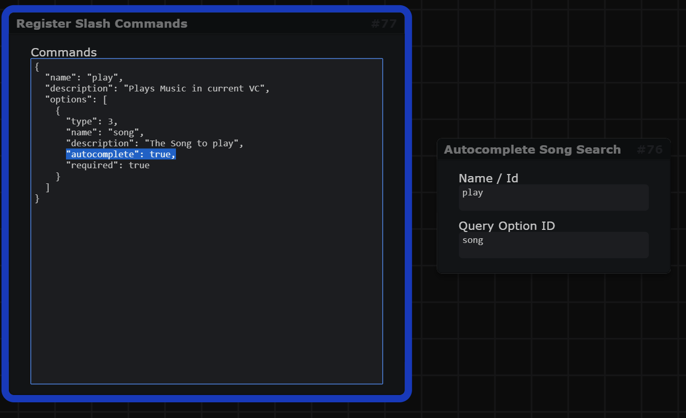

---
hide:
  - toc
icon: material/music-box
---

# :material-music-box: Music Blocks

???+ danger "This Page explains using Mods!"
    :   This Page includes Content using Community Created Mods and may vary from your experience!

    :   [Go to Documentation page for Mods :fontawesome-solid-arrow-right:](mods.md){ .md-button .md-button--primary }

## Setup Playing Music and Dependencies

:   To Start Playing Music in your Bot, you have to setup a "Discord Audio Player Dependency" Block,
    which manages your Package Dependencies for Playing Music.  
    When you enable a Extractor on the Block, it will auto install the Required Package for it to work on the next restart.

:   { width="600" }

---

## Extractor Configuration Guides

### YouTube Extractor
**Getting YouTube Cookie (Required for most videos):**

1. Open a new incognito/private window in your browser (this prevents your cookies from being rotated)
2. Log into YouTube in the incognito window
3. Open DevTools (F12)
4. Go to the Network tab
5. Copy the value of the "Cookie" (its under Request Headers) header from any request to youtube.com
6. Close the incognito window after copying the cookies

### Deezer Extractor
**Getting Deezer Master ARL (Required):**

1. Login to Your Deezer Account on a Web Browser
2. Open Developer Tools (F12)
3. Go to Application > Cookies > https://www.deezer.com
4. Look for the 'arl' Cookie and Copy its Value

### Yandex Music Extractor
**Getting Yandex Music Credentials (Required):**

**Access Token:**

- Follow the Guide at [https://github.com/MarshalX/yandex-music-api/discussions/513](https://github.com/MarshalX/yandex-music-api/discussions/513) to get your Access Token

**User ID (UID):**

1. Go to [https://mail.yandex.ru/](https://mail.yandex.ru/)
2. Your UID will be visible in the URL

### SoundCloud Extractor
**Getting SoundCloud Credentials (Optional):**

If you want to use your own credentials instead of the default ones:

1. Go to [https://developers.soundcloud.com/](https://developers.soundcloud.com/)
2. Create an application or use an existing one
3. Copy the **Client ID** from your application dashboard
4. Copy the **OAuth Token** from your application dashboard

*Note: If not provided, a default Client ID and OAuth Token will be used, which may have limitations.*

### Spotify Extractor
**Getting Spotify Credentials (Optional):**

If you want to use your own credentials instead of the default ones:

1. Go to [https://developer.spotify.com/dashboard/applications](https://developer.spotify.com/dashboard/applications)
2. Create an application or use an existing one
3. Copy the **Client ID** from your application dashboard
4. Click "Show Client Secret" and copy the **Client Secret**

*Note: If not provided, default credentials may be used with potential limitations.*

### Text-to-Speech (TTS) Extractor
**Usage:**

- Enable the TTS extractor to play text as speech
- Use the format: `tts:Your Text Here` when playing
- Set the language code (e.g., 'en' for English, 'es' for Spanish, 'de' for German, 'fr' for French)
- Default language is 'en' (English)

---

## Play Music in Voice Channel

:   Playing Music takes a bit of practice to get right, but here i will show you how to do it safely and rather easy:
:   

---

## Setup Slash Command Autocomplete

:   Below is an example of how to enable Auto Complete on a slash command:
:   
