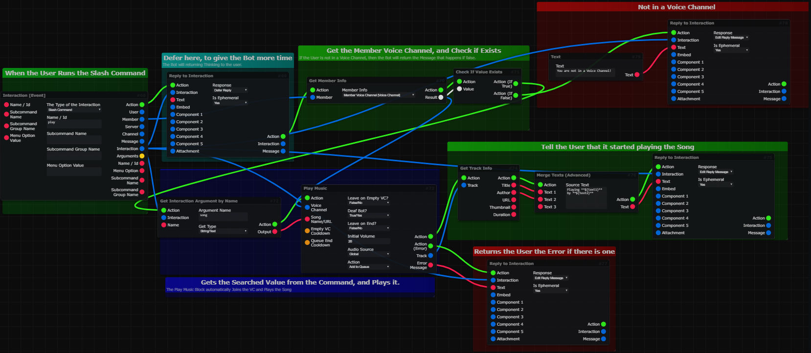

icon: material/music-box

# :material-music-box: Music Blocks

<h3> Play Music in Voice Channel </h3>

:   Playing Music is really easy, and doesn't take a lot of Blocks... Here is a Simple Example:
:   

<h3> Setup Slash Command Autocomplete </h3>

:   Below is an example of how to enable Auto Complete on a slash command: 
:   