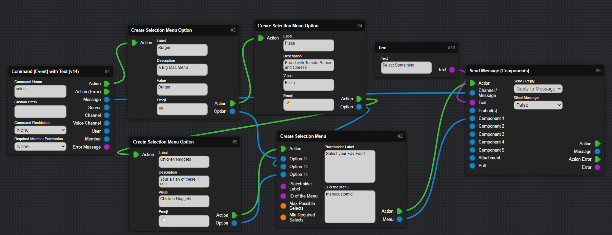
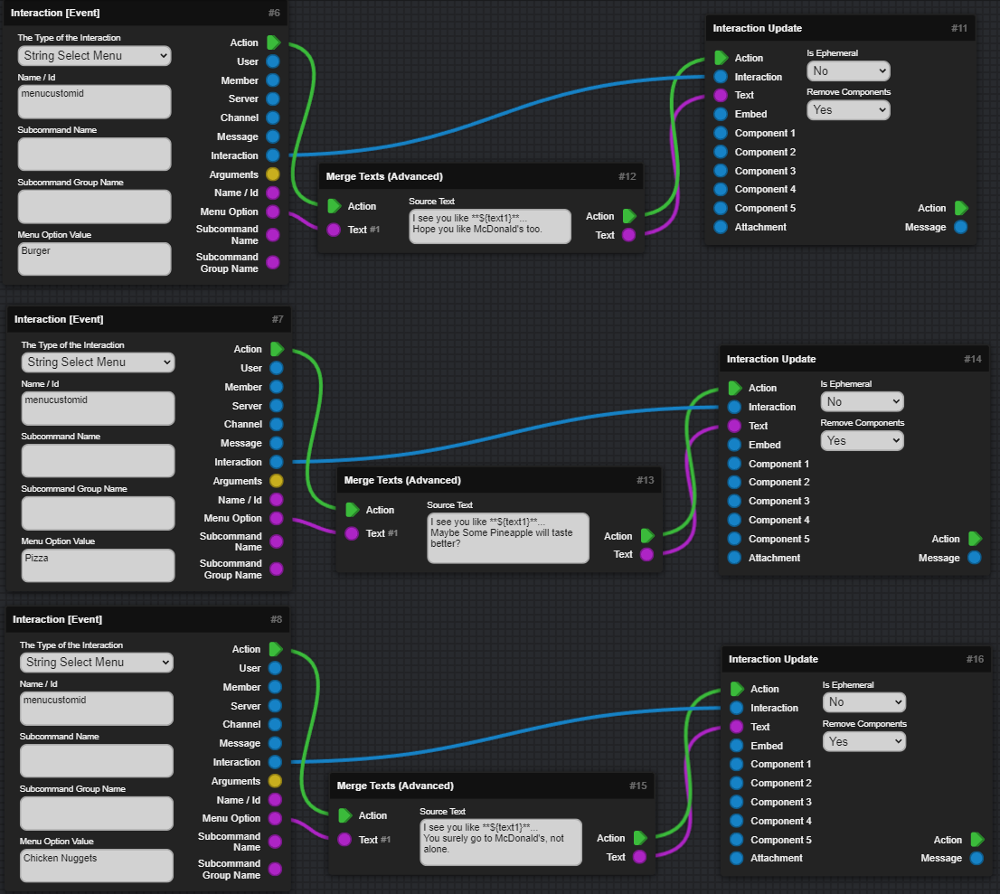
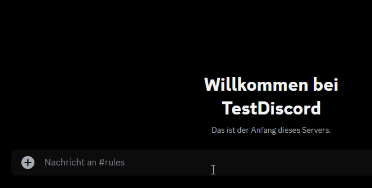
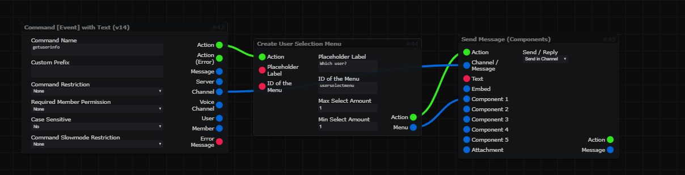
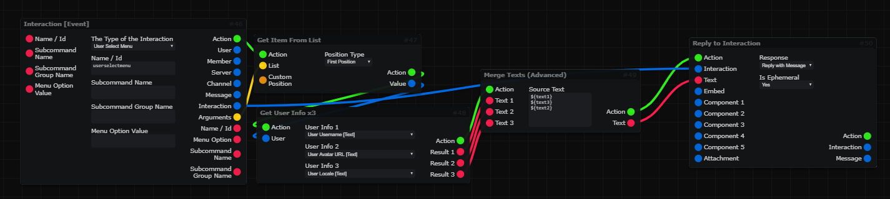
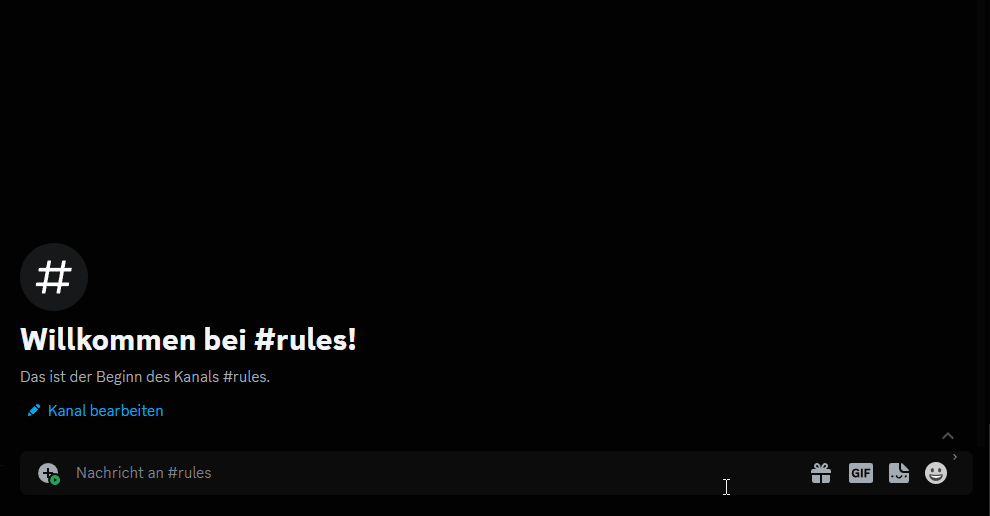

icon: material/form-dropdown

# :material-form-dropdown: Select Menus

This Section will explain how to create and use Select Menus.

???+ danger "This Page explains using Mods!"
    :   This Page includes Content using Community Created Mods and may vary from your experience!

    :   [Go to Documentation page for Mods :fontawesome-solid-arrow-right:](mods.md){ .md-button .md-button--primary }

=== "String Select Menu"
    <h2> String Select Menu </h2>

    :   A String Select Menu, is the default Menu that can have anything selectable with Text, emojis and a Description.  
    Here is a Example for a Select Menu!  

    <h3> Creating the Select Menu </h3>

    :   This will create 2 Select Menu Options and each will be connected with one Select Menu, to get Send with a Message.  

    :     

    <h3> Reacting to the Select Menu </h3>

    :   The Select Menu uses the Interaction Event when used.  
    The `Menu Option Value` has to include the Value of your single option which needs to be selected for this Action to run,  
    and also set the CustomID of the Select Menu in the `Name / ID`.  

    :   Now you can use the Individual `Interaction [Event]` Blocks to handle the Select Menu Interaction Values, you can Update the Interaction by using `Interaction Update` and connect `Interaction` and `Text` to it. Optionally you can use `Merge Texts (Advanced)` to combine the Name of the Menu Option with other Text. 

    :     

    <h3> Testing in Discord </h3>

    :   After you run your Bot you should be able to see your Menu using the Command of your choice. Once you select something, the bot should return a Message or whatever you set!

    :     

    ***

=== "User Select Menu"
    <h2> User Select Menu </h2>

    :   The User Select Menu is, again, much easier then the String Select Menu.  
    You just need one Block to create it!  

    <h3> Creating the Select Menu </h3>

    :   Use a Command, then create your Select Menu, then send that Menu. It can't get any simpler than that!  

    :     

    <h3> Reacting to the Select Menu </h3>

    :   Then use the `Interaction Event`, in Combination with `Get Item from List` to get the User.  
    Then Get the Information you need about the User and Reply back to the Interaction. 

    :   

    <h3> Testing in Discord </h3>

    :   After you run your Bot, just use the Command and Interact with the Select Menu, then it should work...

    :   

    ***