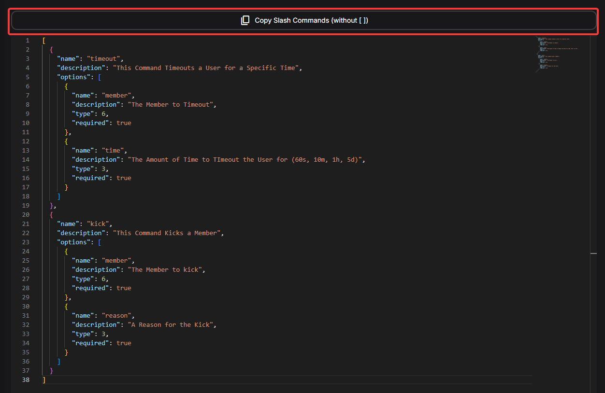
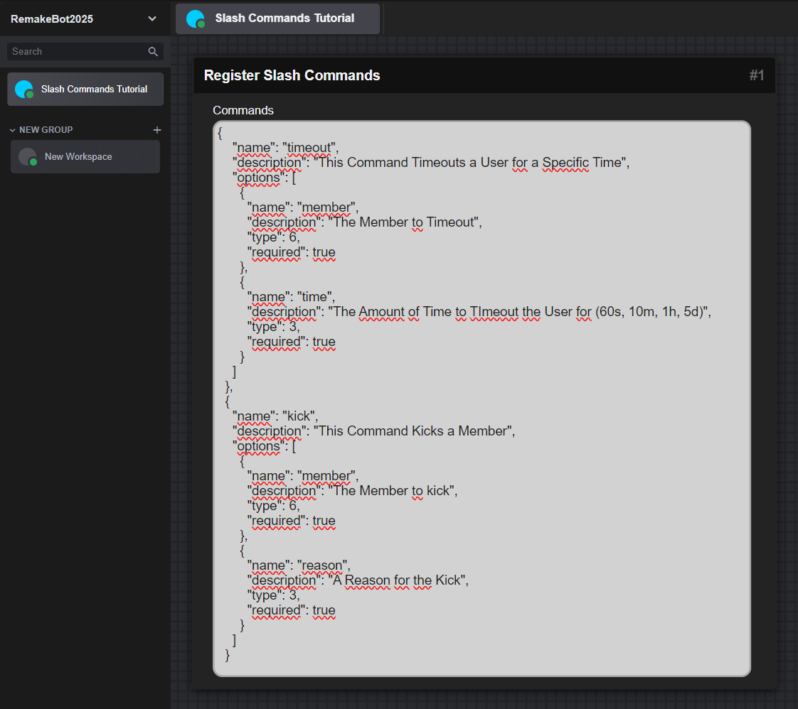
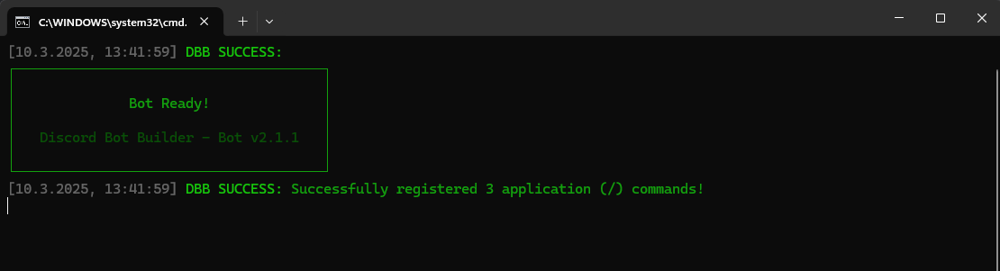

---
hide:
  - toc
icon: material/slash-forward-box
---

# :material-slash-forward-box: Slash Commands
This Section will explain how to Create, Setup and Use Slash Commands.


=== "1. Slash Commands Startup"  

    To start using Slash Commands, you have to create a Slash Command Structure/Interface in Developer Terms.  
    This Structure tells Discord how to display the Command with which texts and which options.  
    This Step is required for Discord to know that you want to handle this command as a Interaction.

    === "1.1. Create Commands"

        First go to the [Slash Commands Builder](slash-command-builder.md){target=_blank} and Create a command of your Choice.  
        In this example we will create a Kick and Timeout Command:  
        

    === "1.2. Copy Command Code"

        After your created your Command on the left Side of the Screen, you click the `Copy Slash Commands (without [])` Button to Copy it in a Format that DBB can Read  
          
          

        [After this, Continue to the Next Step :fontawesome-solid-arrow-right:](#slash-commands-13-add-commands-to-dbb){ .md-button .md-button--primary }

    === "1.3. Add Commands to DBB"

        !!! danger "Important to know!"
            - You can add multiple Commands by using `,` to split the commands

        

=== "2. Handling Interactions"

    For each Slash Command or other Button, Modal, Select Menu or Context Menu Interaction there needs to be a so called handler.  
    This Handler catches/detects when one of those interactions was used and then you as the builder can decide what happens when it was used.  
    Thats also the reason why it is important that Buttons have a CustomID, to differenciate which specific button was used.  

    === "2.1. Kick Command"

        First we Build the Kick Command Handler. For that we use the [Interaction Event](https://blocks.dbb.software/Blocks/interaction_event.js){:target="_blank"} Block. Next we use the [Get Interaction Argument by Name](https://blocks.dbb.software/Blocks/get_interaction_argument_by_name.js){:target="_blank"} to get the Member and Reason. Next we use the `Kick Member` Block and connect everything. Optionally you can use the `Merge Texts [Advanced]` Block to add the Mention of the Mmeber to a Message, you can reply to the Interaction using `Reply to Interaction`.  
        

    === "2.2. Timeout Command"

        Next we will build the Timeout Command Handler. For that we again use the [Interaction Event](https://blocks.dbb.software/Blocks/interaction_event.js){:target="_blank"} Block. Next again use the [Get Interaction Argument by Name](https://blocks.dbb.software/Blocks/get_interaction_argument_by_name.js){:target="_blank"} Block to get the Member and the Time Number in Minutes. After that we use the `Timeout Member` Block and add the Rest of the Optional Stuff if needed.  
        

    === "2.3. Testing the Finished Product"

        After you start your Bot the Command(s) should be available in Discord!  
        

=== "Making Subcommands"

    Subcommands are not much different from natural Slash Commands and even work the same way...  
    There are just some changes to the normal way.  

    === "Building the Subcommand"

        On the [Slash Commands Builder](slash-command-builder.md){:target="_blank"} you can first setup a main command Name and then for the Argument Type there are two options... Either you select `Subcommand Group`, which allows to setup multiple **Subcommands** within that group. Or you select `Subcommand` and you can have just a **simple subcommand** or multiple subcommands for that one command...  
        In this example we are going to create a **Subcommand Group** with 2 Subcommands and a **Subcommand**.

          
          

        This Example includes a **Echo Command**(Which Repeats the Users Specified Text) and a `messages` Subcommand Group, with a **delete_amount** Subcommand and **del_msg** Subcommand.  
        Both Commands will have different functions within one main Command called `tools`.  

        After you are done building the Command, you can click `View Code` and Copy the JSON like above.  
        ??? question "The Command Code"

            ``` json
            {
                "name": "tools",
                "description": "Manage Bot Tools",
                "options": [
                    {
                        "type": 2,
                        "name": "messages",
                        "description": "Manage the Messages",
                        "options": [
                            {
                                "type": 1,
                                "name": "delete_amount",
                                "description": "Delete a Amount of Messages",
                                "options": [
                                    {
                                        "type": 10,
                                        "name": "amount",
                                        "description": "The Amount of Messages to Delete",
                                        "required": true
                                    }
                                ]
                            },
                            {
                                "type": 1,
                                "name": "del_msg",
                                "description": "Delete a Specifc Message by ID",
                                "options": [
                                    {
                                        "type": 3,
                                        "name": "msgid",
                                        "description": "The Messages ID you want to delete",
                                        "required": true
                                    }
                                ]
                            }
                        ]
                    },
                    {
                        "type": 1,
                        "name": "echo",
                        "description": "Let the bot repeat a Message",
                        "options": [
                            {
                                "type": 3,
                                "name": "msg",
                                "description": "The Message you want the bot to say",
                                "required": true
                            }
                        ]
                    }
                ]
            }
            ```

        After that you paste it into your `Register Slash Commands` Block and then we continue with...

    === "Managing Subcommands in DBB"

        Subcommands are quite similar like Normal Slashcommands but need some special treatments.

        

        As you can see it looks really complicated at first glance, but if you ignore all connections it's pretty understandable. First we start with a `Interaction [Event]` Block and then use `Check if Value Exists` to detect if a **Subcommand Group** was used or not(This is not required if not using `Subcommand Groups`)... 

        **If True**, we check the Subcommand using `Switch (conditional)`(As the Input you set `Subcommand Name` from the `Interaction Event`), the rest after that can be customized to your liking.

        **If False**, we make the same check, in this case there is only one subcommand in the Main command, so we Just use the same stuff we would use in a normal Slash Command.

        I hope this explained Subcommands a bit, it may be hard at first but you'll get into it... Ask around for help on the DBB Discord if you encounter issues.

=== "User Installable Commands"

    With the Latest Discord Update, Slash Commands can be used installable and used across DMs and Discord Servers.  
    ^^**Important to know**^^ is that these Command Interactions usually don't include that much informations like normal Bot Slash Commands cause they happen in Scenarios where the bot is not allowed to look into.

    To make these commands you need to add the following Informations to your Slash Commands Structure:

    ```json
    {
        // ...Other Stuff...
        "description": "Your Slash command description whatever",
        "integration_types": [0, 1], // (1)
        "contexts": [0, 1, 2], // (2)
        // ...Other Stuff...
    }
    ```
    { .annotate }

    1.  Installation contexts where the command is available, only for globally-scoped commands. Defaults to your app's configured contexts.  
        This can be:  
            GUILD_INSTALL = 0   -> App is installable to servers  
            USER_INSTALL = 1   -> App is installable to users  
    2.  Interaction context(s) where the command can be used, only for globally-scoped commands. By default, all interaction context types included for new commands.  
        This can be:  

        GUILD = 0  
        Interaction can be used within servers  

        BOT_DM = 1  
        Interaction can be used within DMs with the app's bot user  

        PRIVATE_CHANNEL = 2  
        Interaction can be used within Group DMs and DMs other than the app's bot user  

    Click the PLUS Icon next to the code to understand what these lines mean.