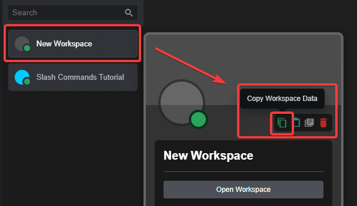

---
hide:
    - toc
icon: material/plus-box-multiple
---

# :material-plus-box-multiple: Adding Workspaces
This Part will Explain how to install/add Workspaces from our [Discord Server](https://discord.gg/PAzxTDw){:target="_blank"}.

=== "Importing"
    === "Written"
        In the Workspaces Channel on the DBB Discord, there you can find a txt file with the JSON Code for the Workspace.
        :   * Download the `.txt` file
            * Copy the contents of the file
            * Open DBB, load a project, create a new Workspace and right click it
            * Then Press the Cyan Colored Paste Button
            * Press `Paste` on the Warning that pops up
            * Done, you have now added a Workspace to your Project!

        (Note: You may need Custom Modded Blocks that should be mentioned in the Thread)

        

    === "Video"
        !!! video "Video Tutorial"
            

=== "Exporting"
    === "Written"
        In DBB, **Right Click** a Workspace in your Workspaces List on the left, and then Press the **GREEN** Copy Button to Copy the Raw JSON Content of the Workspace.

        This can then be pasted into a Discord Chat (Using CTRL+V or German Layout STRG+V) and this way be shared!

        
        